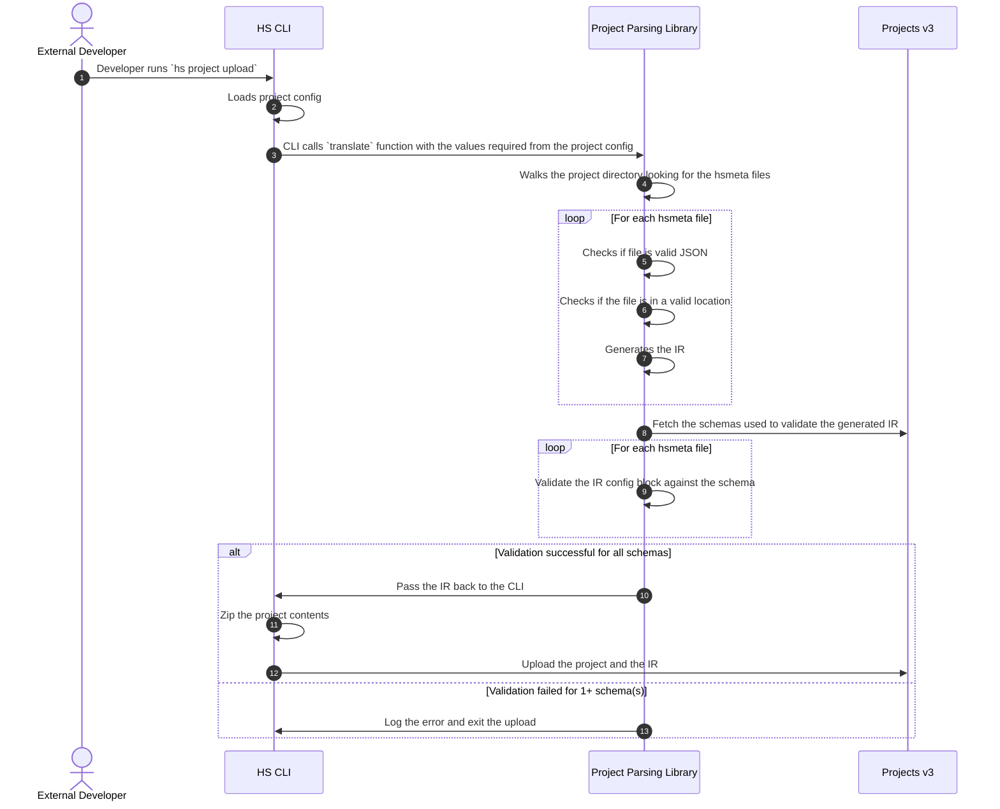

# project-translation-layer

## Description
This project is a translation layer that can be used to translate a project to its immediate representation prior to being uploaded
to the project v2 service.

## Flow Chart

